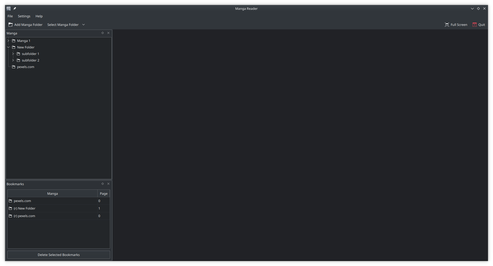
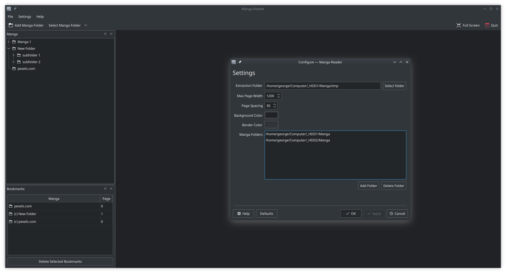
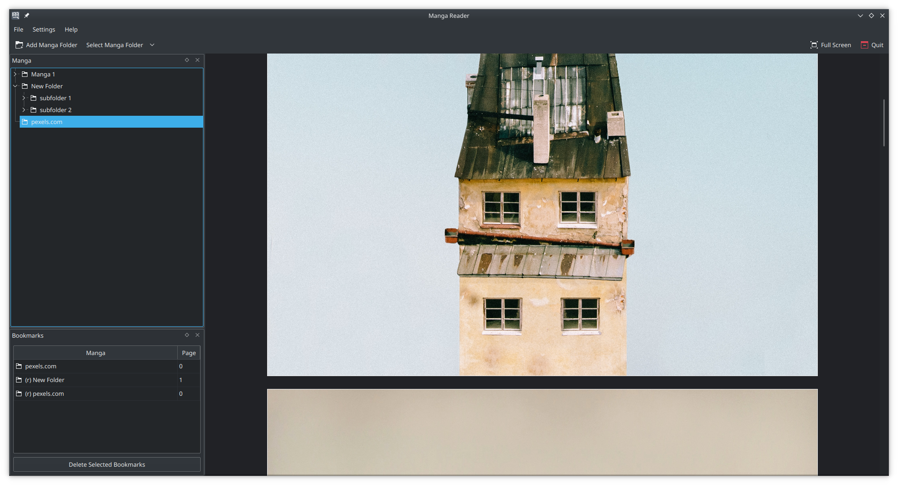

# Manga Reader

A manga reader for local files. Works with folders and archives.

# Installation

Easiest way to install is through [flatpak](https://flathub.org/apps/details/com.georgefb.mangareader), flatpaks should work on all distros.

[Flatpak setup guide](https://flatpak.org/setup/)
```
flatpak install flathub com.georgefb.mangareader
flatpak run com.georgefb.mangareader
```

If you don't like flatpak you can build from source or ask the your distro to provide a package.

# Dependencies

- Extra CMake Modules
- Qt5 Widgets
- KF5 XmlGui
- KF5 ConfigCore
- KF5 CoreAddons
- KF5 I18n
- libarchive

---------------------------------

- c++ compiler
- cmake
- git

# Build

```
git clone https://gitlab.com/g-fb/manga-reader
cd manga-reader
git submodule init
git submodule update
mkdir build && cd build
cmake ..
make
./mangareader

```

# Screenshots




