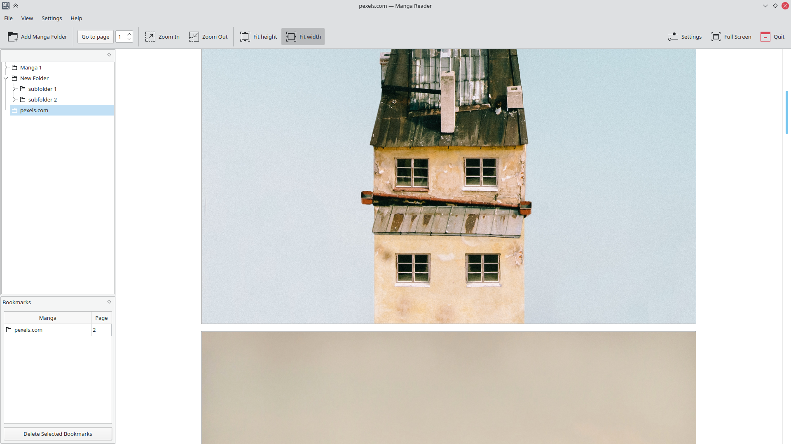

<!--
SPDX-FileCopyrightText: 2020 George Florea Bănuș <georgefb899@gmail.com>

SPDX-License-Identifier: CC-BY-SA-4.0
-->
#### Donate: [GitHub Sponsors](https://github.com/sponsors/g-fb) | [Liberapay](https://liberapay.com/gfb/) | [PayPal](https://paypal.me/georgefloreabanus)

# Manga Reader

A manga reader for local files. Works with folders and archives.

# Installation

Easiest way to install is through [flatpak](https://flathub.org/apps/details/com.georgefb.mangareader), flatpaks should work on all distros.

[Flatpak setup guide](https://flatpak.org/setup/)
```
flatpak install flathub com.georgefb.mangareader
flatpak run com.georgefb.mangareader
```

If you don't like flatpak you can build from source or ask the your distro to provide a package.

# Dependencies

- Extra CMake Modules
- Qt5 Widgets
- KF5 XmlGui
- KF5 ConfigCore
- KF5 CoreAddons
- KF5 I18n
- libarchive

---------------------------------

- c++ compiler
- cmake
- git

# Build

```bash
git clone https://github.com/g-fb/mangareader
cd manga-reader
# append `-D CMAKE_INSTALL_PREFIX:PATH=/your/custom/path` to install to a custom location
cmake -B build -G Ninja
cmake --build build
cmake --install build
```

# Screenshots



